# Lab3Web

Nama   :Sayyid Sulthan Abyan

NIM    :312410496

Kelas  :TI.24.A.5

---

# Praktikum 3: Membuat List, Table, dan Form

---

## Langkah-langkah Praktikum

### Membuat File HTML Awal
Buat file baru bernama **`lab3_list.html`**.  
Isi dengan struktur HTML dasar yang berisi bagian `<head>` dan `<body>`.  
File ini akan digunakan untuk membuat daftar (*list*).

---

### Membuat Ordered List
Ordered List digunakan untuk membuat daftar **terurut** (biasanya dengan angka atau huruf).  
Tambahkan bagian *ordered list* berisi beberapa item di dalamnya.

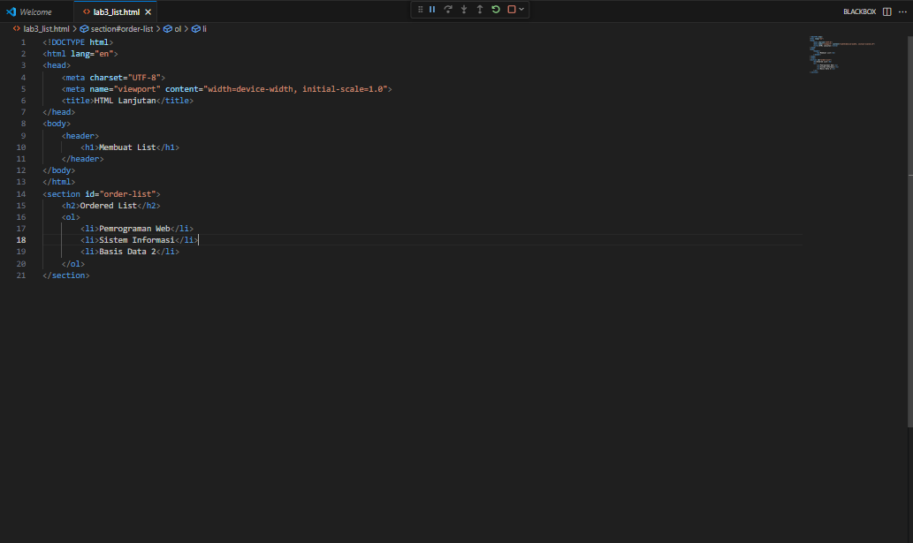
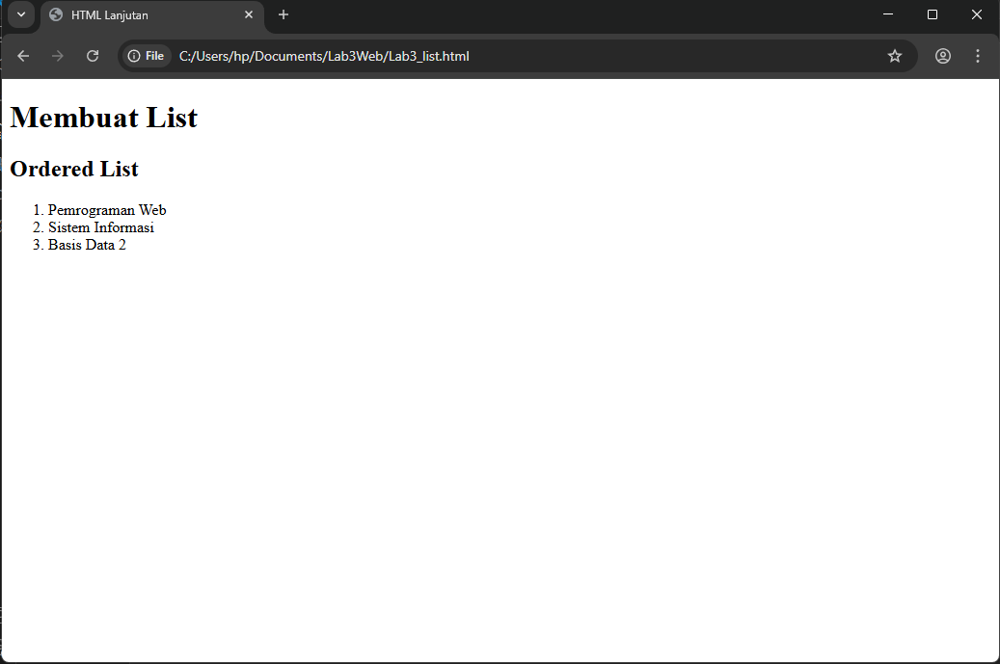

---

### Membuat Unordered List
Unordered List digunakan untuk membuat daftar **tidak terurut**.  
Simbol default-nya berupa lingkaran (*disc*), tetapi bisa diubah menjadi:
- `square` → persegi  
- `circle` → lingkaran kosong  
- `none` → tanpa simbol  

Tambahkan bagian *unordered list* di bawah *ordered list*.

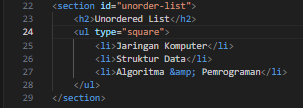
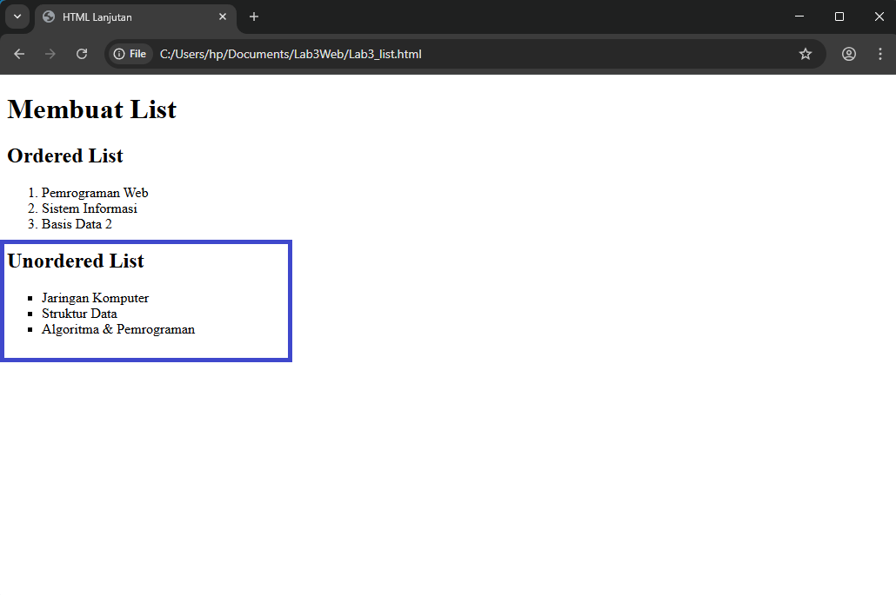

---

### Membuat Description List
Description List menampilkan daftar berisi istilah dan deskripsinya.  
Tambahkan bagian *description list* di bawah *unordered list*.

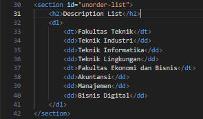
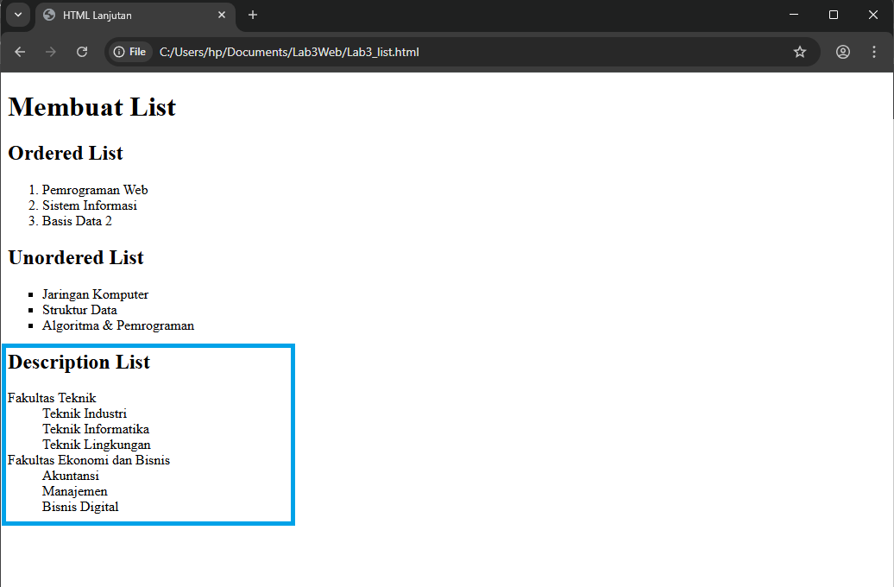

*Tips:* Coba ubah atribut `type` pada list untuk melihat perbedaannya.

---

### Membuat Tabel
Buat file baru bernama **`lab3_tabel.html`**.  
Tabel digunakan untuk menampilkan data dalam format baris dan kolom.  
Tambahkan tabel sederhana dengan kolom:  
**No**, **Fakultas**, dan **Program Studi**.

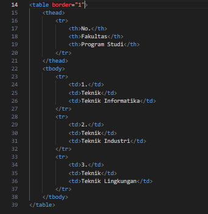
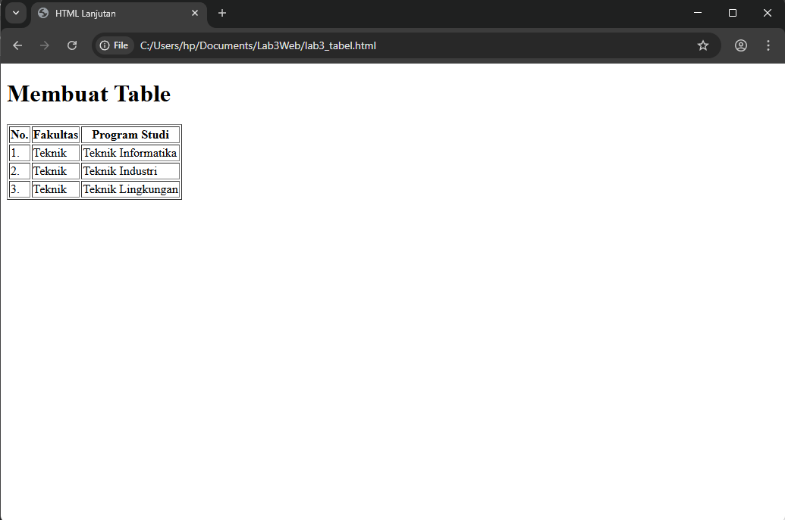

---

### Mengatur Margin dan Padding pada Tabel
Gunakan atribut:
- **`cellpadding`** → jarak antara teks dan garis sel.  
- **`cellspacing`** → jarak antar sel tabel.  

Atur nilai-nilai tersebut agar tabel terlihat lebih rapi.

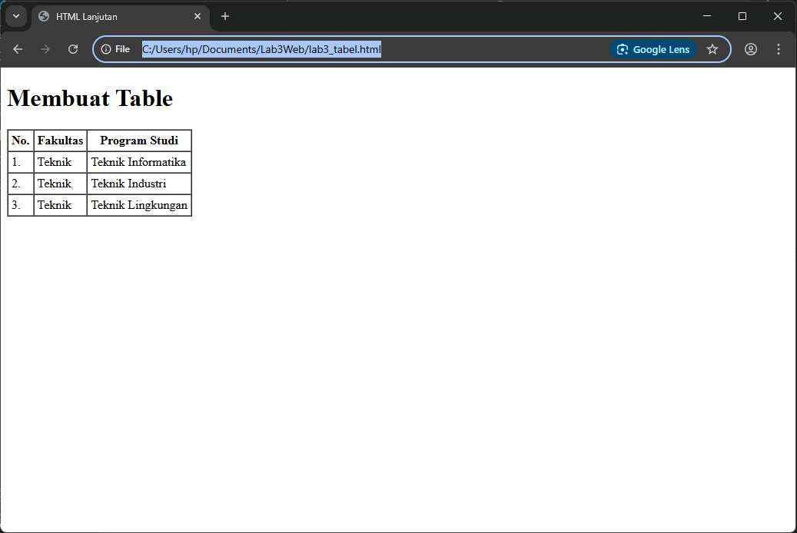

---

### Menggabungkan Sel Data
Untuk menggabungkan sel:
- Gunakan **`rowspan`** untuk menggabungkan baris (vertikal).  
- Gunakan **`colspan`** untuk menggabungkan kolom (horizontal).  

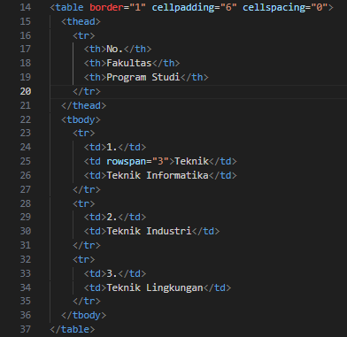
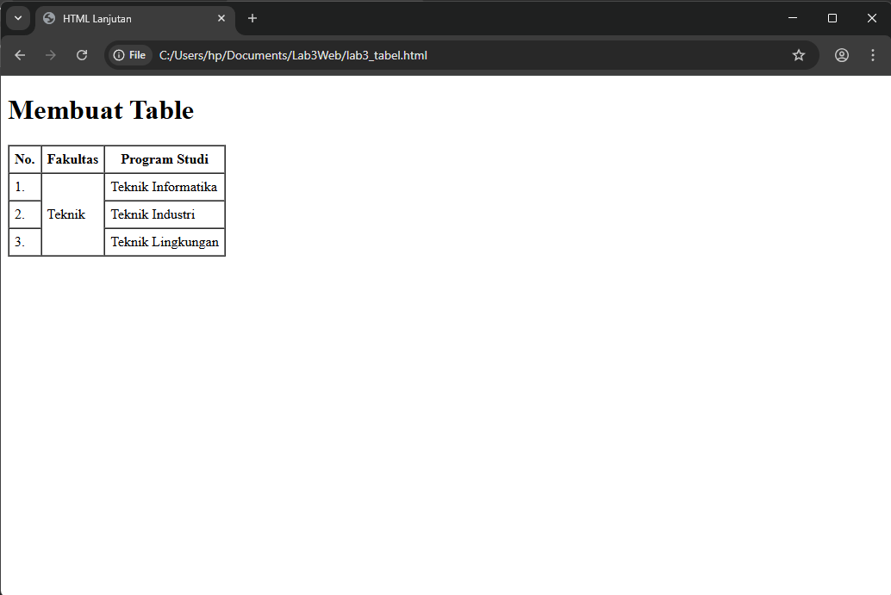

---

### Membuat Formulir (Form)
Buat file baru bernama **`lab3_form.html`**.  
Form digunakan untuk menerima input dari pengguna.  
Tambahkan elemen berikut:
- Field **Nama**  
- Field **Alamat**  
- Pilihan **Jenis Kelamin** (radio button)  
- Tombol **Submit**

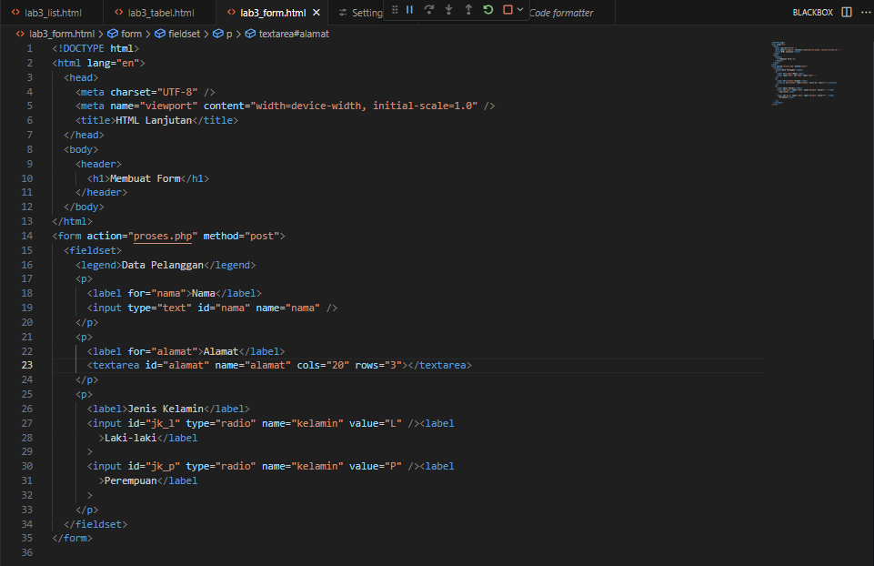
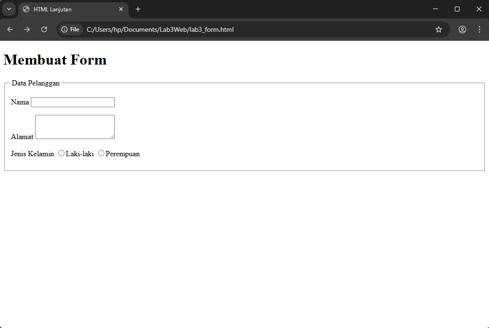

---

### Menambahkan CSS pada Form
Agar form terlihat lebih menarik:
- Atur lebar label agar sejajar dengan input.  
- Tambahkan border dan warna pada input field.  
- Gunakan warna latar dan teks yang kontras pada tombol.

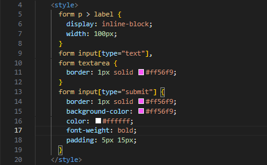
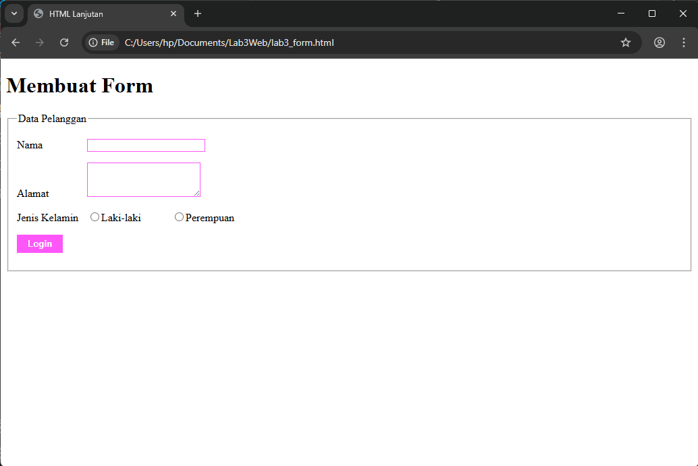

---

## Pertanyaan dan Tugas
1. Buat form yang menampilkan:
   - Dropdown menu  
   - Listbox dengan **multiple selection**

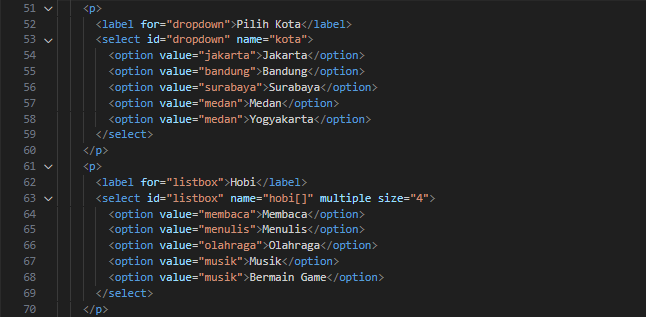
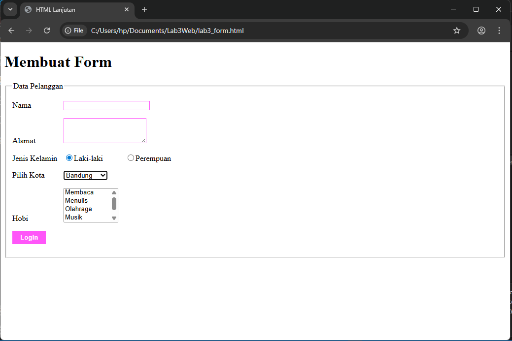

---

